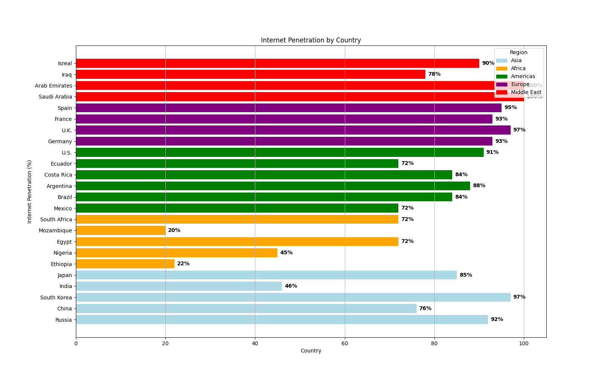
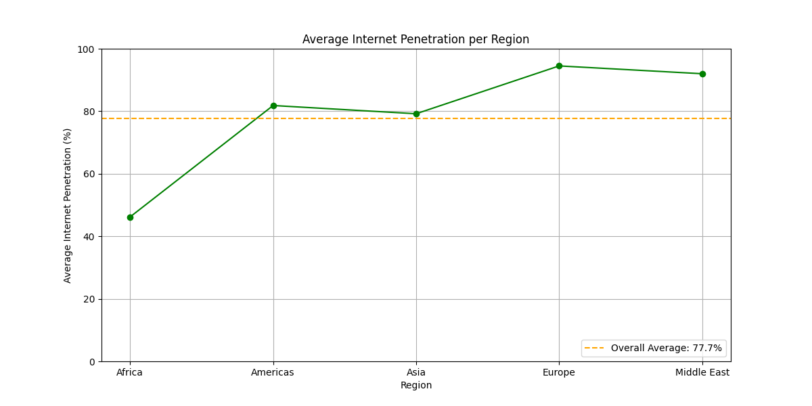

# Axis of Awesome

# Internet Penetration by Country and Region

## Overview

This project takes the internet penetration rates *(The percentage of people in a certain area that actively use the internet)* from multiple countries from around the world as well as their different region to then compile that information and visualizes it in a graph to make for easier understanding and readablity.

## What it does

The script includes two graphs for visualizing the internet pentration rate of diffrent countries nad their regions:

- **Internet Pentration Per Country Bar Chart**: The first graph will plot and visuialize information regarding each country and their internet penetration along with organizing them by region with different colors, and showing their percentages for each country on the bar for better readability.
- **Average Penetration by Region**: The second graph is a line graph that will show the average internet penetration for each region, with a horizontal line and a key defining the average internet penetration of all the regions combined.

**The graphs will be saved in the output folder when run**

## Why?

The pandas library can simplify data manipulation and make data structures more easily managable. The Matplotlib library is excellent for data visualization and couples greatly with the pandas library ability to organize data into an easily graphed format.

## Dependencies

Python is needed to run the script along with the following Python libraries:

- `pandas`: For data handling and manipulation.
- `matplotlib`: For plotting and creating visualizations.

You can install these dependencies via pip by using `pip install pandas matplotlib`

## How to Run it

1. Clone this repository or download the script.
2. Open the console and make sure to put `python` or `python3` infront of path to the file directory to run it. If the file is in the current directory then just put the name of the file.

## Example Output

**Bar chart of internet penetration by country**

**Line graph of average internet penetration per region**

